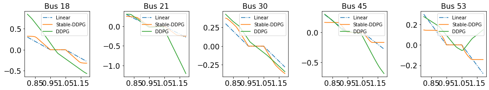
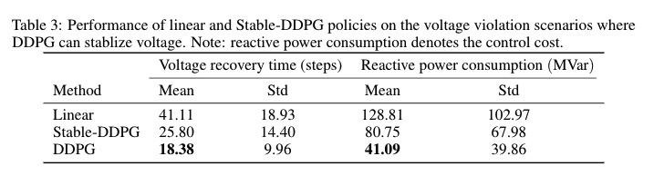

## Stability Aware Policy Learning via Krasovskii's Approach with Application to Voltage Control

We provide our new experiment results in this webpage.

### OpenAI Pendulum Swingup task

#### Performance comparison of the final learned policies

 

#### Training curse of DDPG v.s. Stable-DDPG
 

Fig.1. Average episode reward for DDPG vs Stable-DDPG on [pendulum-v0](https://gym.openai.com/envs/Pendulum-v0/). The horizonal axis is the training iteration, and the vertical axis is the average reward. Plotted curves are average over 5 random seeds, and the shaded region show the standard derivation.

#### Policy performance video

**Stable-DDPG** [Video](https://drive.google.com/file/d/1NJ03cichW3MscIhXtjnSl6-a-kRprOpY/view?usp=sharing)

**DDPG** [Video](https://drive.google.com/file/d/10K-XCp4ohitNwv_giU0j-y0gFRrL-Ky3/view?usp=sharing)

**Joint learning Lypunov and controller** [Video](https://drive.google.com/file/d/1Ybpt3jV82lg0_SgOaJYntNUDBV_dtzTM/view?usp=sharing)

## Voltage Control

### Visualization of DDPG, Stable-DDPG and Baseline Linear Policy

The following figure visualizes the control policy learnt from baseline DDPG, Stable-DDPG and linear policy for five voltage controllers. Compared to the linear controller, the proposed Stable-DDPG learns a nonlinear monotone controller in different shapes. In addition, the policy learnt baseline DDPG shares similar shape but having more expressive power (no monotonicity requirement).

 
Fig.2. Visualization of DDPG, Stable-DDPG and linear control policy at 5 PV buses. The x-axis is voltage (unit: kV) and the y-axis is control action (unit: MVar).

### DDPG v.s. Stable-DDPG v.s. Baseline Linear Policy

As shown in Fig 4 in the submitted paper, baseline DDPG does not guarantee stability and thus can lead to ``infinite'' voltage recovery time and control cost. To obtain a reasonable comparison, we limit the max episode length to be T= 100, and compare the voltage recovery time (steps) and reactive power consumption (MVar) on 500 different voltage violation scenarios. Here are the results.

 

Out of the 500 scenarios, we found that DDPG is able to stabilize 288 scenarios. For the scenarios baseline DDPG can stabilize, we observed that it can further reduce the control cost and recovery time, compared to Stable-DDPG and linear policy, possibly due to the more expressive power of standard neural network compared to monotone network.

 

